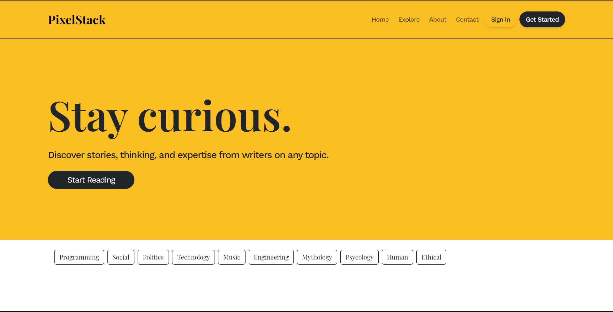
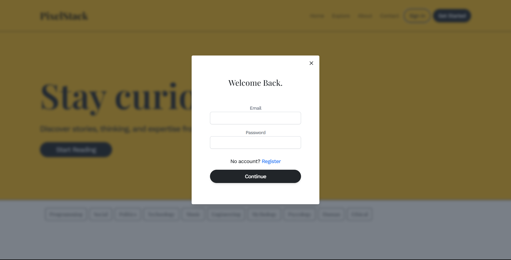
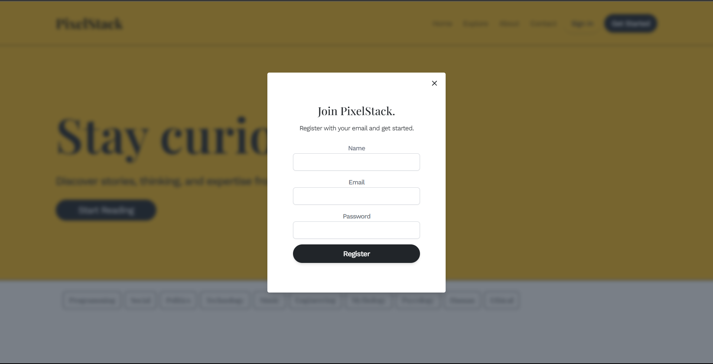
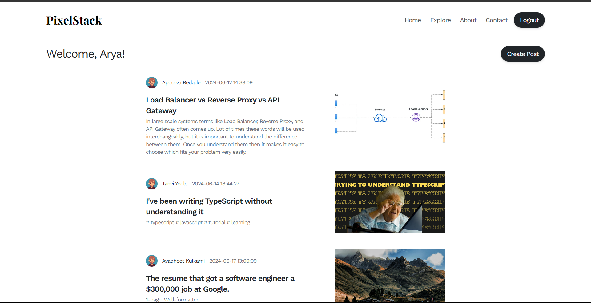

# PixelStack

PixelStack is a Full Stack Blog Application built using the MERN stack (MongoDB, ExpressJS, ReactJS, and NodeJS). It allows users to register, create, and manage their own blog posts on various topics. The application features a responsive design using TailwindCSS and Bootstrap v5.3.

## Features

- **User Registration**: Users can create an account by providing their name, email, and password. The application uses secure authentication methods to ensure the safety of user data.

- **Blog Creation**: Registered users can create new blog posts by providing a title, content, and optional images. The blog editor supports Markdown formatting for easy content creation.

- **Blog Management**: Users can view, edit, and delete their own blog posts. They can also update their profile information and change their password.

- **Responsive Design**: The application is designed to be mobile-friendly and accessible on various devices. It utilizes the power of TailwindCSS and Bootstrap v5.3 to create a visually appealing and user-friendly interface.

- **Search and Filtering**: Users can search for blog posts based on keywords and filter them by author or category.

- **Comments and Interactions**: Readers can leave comments on blog posts and engage with the authors. Authors can moderate and reply to comments on their posts.

## Tech Stack

- MongoDB: Database for storing user information and blog posts.
- ExpressJS: Backend framework for handling server-side logic.
- ReactJS: Frontend library for building user interfaces.
- NodeJS: JavaScript runtime for server-side development.
- TailwindCSS: Utility-first CSS framework for styling.
- Bootstrap v5.3: Frontend framework for responsive design.

## Demo

### Homepage

The layout is kind of made similar to [Medium.com](https://medium.com) because it is a good design and thought it would be better use it for my project

### Login and Signup
<table>
  <tr>
    <td>
      
    </td>
    <td>
      
    </td>
  </tr>
</table>
These are a single modal component that are populated based on which button the user has clicked (Sign in or Get Started)

Any Notification which are to be displayed during login, signup or blog create, a toast notification is shown using [React Toastify](https://fkhadra.github.io/react-toastify/introduction/) Library

### User Dashboard

On the dashboard, all the blogs created by users registered with PixelStack are visible on the User Dashboard
Registered User can also create it's own blog post on any topic

### Create Post

To create a Blog, simply 3 fields are to be filled
- A title supporting the Blog
- Summary which defines the post in short
- A cover image
- Blog Content
  
The Blog content can be well formatted by making the use of [React Quill Text Editor](https://zenoamaro.github.io/react-quill/)

---

This was the complete walkthough for PixelStack. This was a good project in MERN Stack which involved building everything from scratch.

Feel free to checkout the repo and contribute any feature you wish to💫